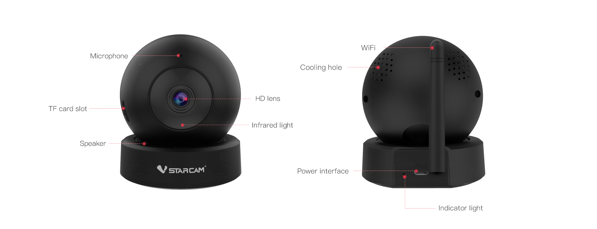

# Журнал работы над проектом

## IP-camera
Разобраться с IP-камерами, приобрести подходящую, разобраться с ней.

Выбран VSTARCAM (https://www.vstarcam.com/1056.html) самая дешевая HD  
c поддержкой onvif-протокола, чтобы общаться с ней из любого софта.


Потрачено много времени на подключение.

**Ccылки**   
Программа для работы и настройки   
https://sourceforge.net/projects/onvifdm/  
Список адресов (у разных камер разный адрес!) получения потока    
http://www.ispyconnect.com/cameras 


## Распознавание доски, крестиков и ноликов  
Попробуем так, возможно, для игры хватит:  

_Доска_ в аппроксимации - 20-угольник, внутри которого четырехугольник
```python   
def detect_board(contours, hierarchy):
    for i, c in enumerate(contours):
        if cv2.arcLength(c, True) < 50:
            continue
        epsilon = 0.02 * cv2.arcLength(c, True)
        poly = cv2.approxPolyDP(c, epsilon, True)
        if len(poly) == 20:
            if hierarchy[0][i][2] != -1:
                inside = contours[hierarchy[0][i][2]]
                epsilon = 0.02 * cv2.arcLength(inside, True)
                poly = cv2.approxPolyDP(inside, epsilon, True)
                if len(poly) == 4:
                    return i
    return None
```
_Крестик_ - отношение расстояния ближней от центра контура точки и ближней - мало  
_Нолик_ - в ином случае 
```python
def detect_sign(contour):
    '''NOUGHT or CROSS'''
    center, r = cv2.minEnclosingCircle(contour)
    mind = r * r
    for p in contour:
        d = dist2(p[0], center)
        if d < mind:
            mind = d
    # print(mind / (r * r))
    if mind / (r * r) < 0.1:
        return X
    else:
        return O
```


Да... Посторонние предметы (можно отсечь выделением области игры), 
но, главное, четырехугольник внутри распознается как нолик...

Начало положено!

## Логика игры
Найдены в сети и адаптированы функции логики игры. См. файл [tttutils.py](../tttutils.py). 

## Отрисовка позиций
Написан код отрисовки позиций.
```python
 def draw_position(self, img, position=None, left_top=(10, 10), size=90, color=(255, 0, 0)):
        cv2.rectangle(img, left_top, (left_top[0] + size, left_top[1] + size), (255, 255, 255), -1)
        if position is None:
            if len(self.positions) == 0:
                return
            position = self.positions[-1]

        cell_size = int(size / 3)

        for i in range(0, size + 1, cell_size):
            cv2.line(img, (left_top[0] + i, left_top[1]), (left_top[0] + i, left_top[1] + size), color, 2)
            cv2.line(img, (left_top[0], left_top[1] + i), (left_top[0] + size, left_top[1] + i), color, 2)

        for i in range(3):
            for j in range(3):
                if position[i][j] == O:
                    center = (
                        left_top[0] + j * cell_size + cell_size // 2, left_top[1] + i * cell_size + cell_size // 2)
                    cv2.circle(img, center, cell_size // 2 - 5, color, 2)
                if position[i][j] == X:
                    cv2.line(img, (left_top[0] + j * cell_size + 5, left_top[1] + i * cell_size + 5),
                             (left_top[0] + (j + 1) * cell_size - 5, left_top[1] + (i + 1) * cell_size - 5), color, 4)
                    cv2.line(img, (left_top[0] + (j + 1) * cell_size - 5, left_top[1] + i * cell_size + 5),
                             (left_top[0] + j * cell_size + 5, left_top[1] + (i + 1) * cell_size - 5), color, 4)

```


## Выделение

Написана функция выделения части доски мышью, что предотвращает 
нахождение ложных крестиков и ноликов 
